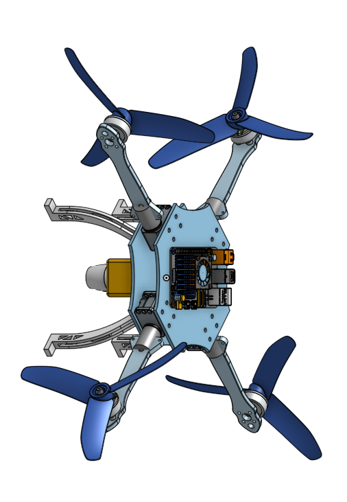

# Tilting Drone X4




<a href="https://youtu.be/gHeF0P1Z8pc" target="_blank">
  
</a>

This repository contains a comprehensive simulation model of a tilting-arm quadcopter, complete with a control system based on the PX4-Autopilot SITL (Software in the Loop). The control system is integrated into the PX4-Autopilot firmware at the low-level. A high-level implementation of the same controller is available on the [feedback_control branch](https://github.com/MayurRabadiya/tilting_drone_x4/tree/feedback_control).

## Minimum Requirements

- **Operating System**: Ubuntu 22.04
- **ROS Version**: ROS 2 Humble
- **Simulation Environment**: Gazebo Garden/Harmonic

## Setup Instructions

### 1. Clone the Repository

Begin by cloning the repository into your workspace:

```bash
mkdir -p ~/workspace/drone_x4_ws/src
cd ~/workspace/drone_x4_ws/src
git clone https://github.com/MayurRabadiya/tilting_drone_x4.git
```

### 2. Setup Dependencies

Set up the required dependencies. The default branch for the `drone_x4_px4` dependency is "main":

```bash
cd tilting_drone_x4
sh setup_dependencies.sh <branch-name-of-drone-x4-px4>
```

You can find the dependency repository here: [drone_x4_px4](https://github.com/MayurRabadiya/drone_x4_px4.git).

### 3. Workspace Structure

After completing the setup, your workspace should have the following structure:

```plaintext
workspace
├── drone_x4_ws
│   └── src
│       ├── tilting_drone_x4
│       └── px4_msgs
├── drone_x4_px4
└── Micro-XRCE-DDS-Agent
```

## Running the Simulation

### 1. Build the Workspace

To build the workspace, execute:

```bash
cd ~/workspace/drone_x4_ws
colcon build --symlink-install
source install/local_setup.bash
```

### 2. Launch the Simulation

The simulation can be launched with the following command:

```bash
ros2 launch tilting_drone_x4 drone_x4.launch.py
```

This command will run the simulation in an empty environment. To run the simulation in different environments, use the following commands:

```bash
ros2 launch tilting_drone_x4 drone_x4.launch.py world:=_window
ros2 launch tilting_drone_x4 drone_x4.launch.py world:=_wind_turbine
```

### 3. Start the Trajectory Node

To start the trajectory generation, run:

```bash
ros2 run tilting_drone_x4 trajectory_node.py
```

## Trajectory Modes

The simulation supports several trajectory modes that can be controlled using `rqt_reconfigure`. The available modes are:

- **Mode 0**: Manual mode – Control the drone with manual inputs from the parameter server.
- **Mode 1**: Lemniscate (figure-eight) trajectory tracking.
- **Mode 2**: Circular trajectory tracking.
- **Mode 3**: Star-shaped trajectory tracking.
- **Mode 4**: Spiral trajectory tracking.
- **Mode 5**: Wind turbine blade scanning.

### Adjusting Parameters

Parameters can be adjusted using `rqt_reconfigure`:

```bash
ros2 run rqt_reconfigure rqt_reconfigure
```

The configurable parameters include:

- **mode**: Changes the trajectory mode.
- **radius**: Adjusts the radius for circular and lemniscate trajectories.
- **t_dt**: Controls the speed of the drone (specific to circular and lemniscate trajectories).
- **speed**: Controls the speed for star-shaped trajectories and wind turbine scans.
- **spiral_h**: Adjusts the height of the spiral rings.

## Updating Controller Gains

Gains can be updated either through `rqt_reconfigure` or directly in the PX4 airframe file. Note that if the ROS 2 node is running, gains will be updated from `rqt_reconfigure`.

To update gains manually, edit the airframe file located at:

```bash
~/workspace/drone_x4_px4/ROMFS/px4fmu_common/init.d-posix/airframes/7242_gz_tilting_drone_x4
```

The relevant parameters are:

- **MC_KR*_GAIN**: Rotation gain
- **MC_KA*_GAIN**: Angular velocity gain
- **MC_KX*_GAIN**: Position gain
- **MC_KV*_GAIN**: Velocity gain

## Troubleshooting Gazebo

### Drone Model Not Spawning

If the drone model fails to spawn in Gazebo, you may encounter the following error:

```plaintext
ERROR [gz_bridge] Service call timed out. Check GZ_SIM_RESOURCE_PATH is set correctly.
ERROR [gz_bridge] Task start failed (-1)
ERROR [init] gz_bridge failed to start and spawn model
ERROR [px4] Startup script returned with return value: 256
```

To resolve this, ensure that your network interface is multicast-enabled. Check this using ROS 2 tools:

In Terminal 1:

```bash
ros2 multicast receive
```

In Terminal 2:

```bash
ros2 multicast send
```

If you do not receive a message similar to:

```plaintext
Received from xx.xxx.xxx.xx:43751: 'Hello World!'
```

you may need to update your firewall configuration to allow multicast:

```bash
sudo ufw allow in proto udp to 224.0.0.0/4
sudo ufw allow in proto udp from 224.0.0.0/4
```

Verify that the multicast flag is enabled on your network interface using `ifconfig`:

```bash
ifconfig
```

Look for the `MULTICAST` flag in the output.

### Killing Gazebo

If you need to forcefully close Gazebo, use:

```bash
pkill -9 ruby
```

For further troubleshooting, refer to the [ROS 2 Installation Troubleshooting Guide](https://docs.ros.org/en/rolling/How-To-Guides/Installation-Troubleshooting.html#linux).
